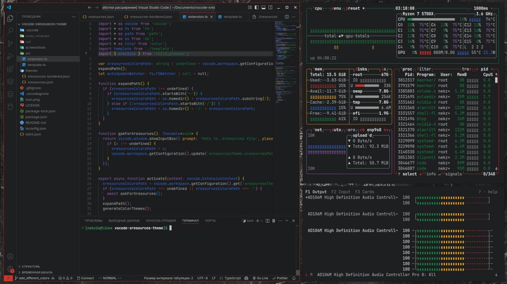

# Xresources Theme Plus

This extensions for Visual Studio Code adds a **real time updated theme** that is dynamically generated from the color palette in your existing Xresources file. This fork just adds some changes for `.Xresources` properties, such as `*.background`, `*.foreground` and `*.cursorColor`. I also added some styling minor changes as shadows, shades of some colors and colors of syntax tokens. I Also changed icon as a little joke about simplified gradient logos trend 😛

## Themes and Colors

There is Two Different themes (Bordered and Normal) in three variants:

- **Light** - uses light versions of `.Xresources` colors `[color8 - color15]` _(preferable for dark themes)_
- **Dark** - uses dark versions of `.Xresources` colors `[color0 - color7]` _(preferable for light themes)_
- **Mixed** - uses all colors (may look _not so cool_ on different themes)

## Features

- Real time updates of the color scheme
- Two variants available: borderless and bordered
- Works out of the box: just set xresourcesPath at first startup

## Requirements

In order to use this extension xrdb is needed, if your Xresources file is configured correctly it should be working, check with `xrdb -query -all`

## Extension Commands

This extension contributes the following command:

- `xresourcesTheme.update`: execute a manual update of the theme

## Extension Settings

This extension contributes the following settings:

- `xresourcesTheme.autoUpdate`: enable/disable the auto update of the theme provided by this extension
- `xresourcesTheme.xresourcesPath`: path to the Xresources file

## Troubleshooting

If the extension doesn't update automatically, while the auto updates are enabled, try to do a manual update with the update command.
If the manual update doesn't work try reloading the window.

---

## Credits

This extension is forked from [vscode-xresources-theme](https://github.com/MadelineVandergriff/vscode-xresources-theme) made by [MadelineVandergriff](https://github.com/MadelineVandergriff), which is also fork of [vscode-wal-theme](https://github.com/dlasagno/vscode-wal-theme), which was inspired by [Ayu](https://github.com/ayu-theme/vscode-ayu) and [vscode-wal](https://github.com/bluedrack/vscode-wal).
